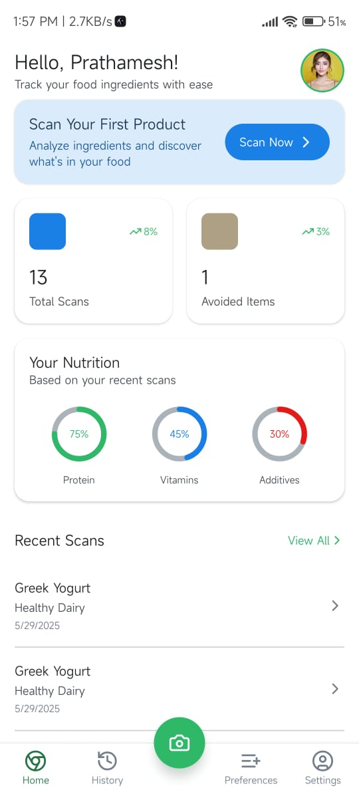
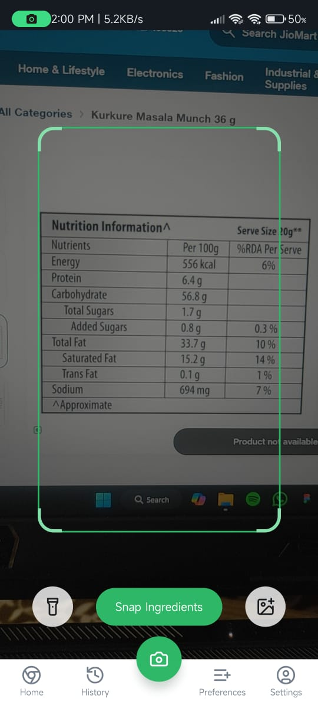
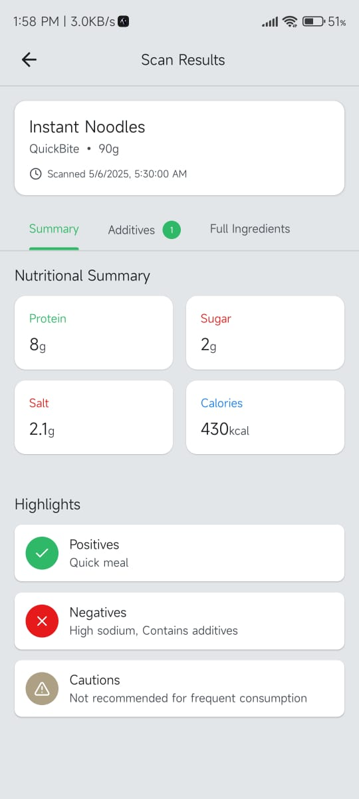
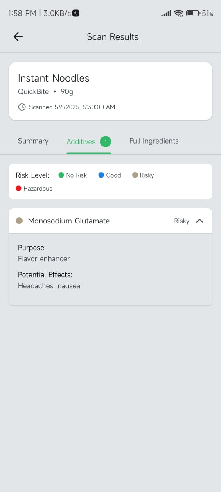
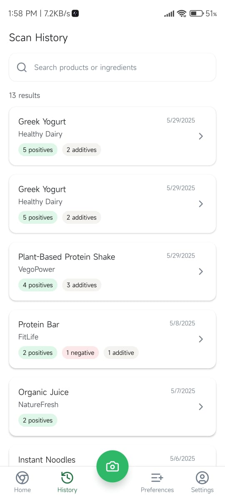
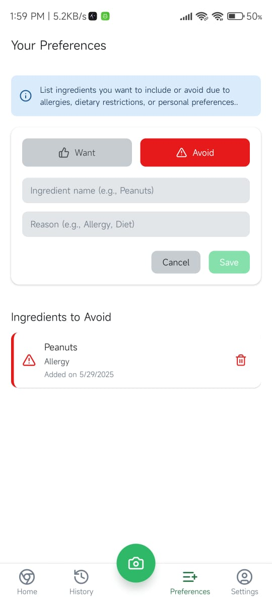

# 🍱 NutriScan - Packaged Food Barcode Scanner App

NutriScan is a React Native app built with Expo that allows users to scan barcodes on packaged foods and instantly receive detailed nutritional information. It empowers users to make informed dietary choices based on their personal health preferences, highlighting harmful additives and nutritional quality using the Open Food Facts API.

---

## 🚀 Features

- 📷 **Barcode Scanner**  
  Scan any packaged food barcode using your smartphone camera.

- 🧠 **AI Integration (Upcoming)**  
  Smart recommendations and explanations about products using AI.

- 🧪 **Nutritional Breakdown**  
  Instantly view:
  - Nutritional summary (fat, sugar, salt, etc.)
  - Positive/negative health ratings
  - Full list of ingredients
  - Additives and flags for harmful/risky substances

- ⚙️ **Ingredient Preferences**  
  Users can set:
  - Ingredients/additives to **avoid** (e.g., artificial sweeteners, palm oil)
  - Ingredients to **prefer** (e.g., high fiber, low sodium)

- 📊 **Realtime Stats & Analytics**  
  - Track **total scans**
  - Get nutrition insights based on **recent scans**
  - Learn patterns and trends from scanning history

- 🇮🇳 **Localized Needs for Indian Market**  
  Focused on Indian-packaged foods and common dietary concerns in India (e.g., excessive salt, trans fats, artificial colors).

---

## 🧑‍💻 Technical Working

### 🛠 Tech Stack

- **Framework**: React Native + Expo
- **Backend API**: [Open Food Facts](https://world.openfoodfacts.org/data)
- **State Management**: React Context API
- **Barcode Scanner**: `expo-barcode-scanner`
- **Storage**: AsyncStorage (for local scan history and preferences)
- **Analytics**: Custom built based on scan frequency and nutrition tags

### ⚙️ Flow

1. **Barcode Scanning**
   - The `expo-barcode-scanner` captures the barcode value.
   - This value is sent to Open Food Facts API.

2. **Data Fetching**
   - Fetches nutritional data, additives, and ingredients for that product.

3. **Data Parsing & Flagging**
   - Parses ingredients and additives.
   - Compares against the user's custom ingredient preference list.
   - Flags any harmful additives based on predefined tags (like E211, E102).

4. **Result Display**
   - Nutritional summary shown in a clean card-based UI.
   - Flags show risk level, harmfulness, and reasons.
   - Additives are categorized with colors (green-safe, red-harmful, yellow-moderate).

5. **Analytics**
   - Stores scan history locally.
   - Provides basic analytics: most scanned type, avg. sugar/fat/salt intake from recent scans.

---
📸 Screenshots 

  
 |  |  |
    


## 🇮🇳 Why This App is Needed in the Indian Market

- India is witnessing a **rapid increase in lifestyle diseases** like diabetes, hypertension, and obesity.
- Many packaged foods contain **hidden sugars, salts, trans fats, and harmful additives** that aren't easily understood by common consumers.
- Indian users often lack access to:
  - **Nutritional literacy**
  - **Transparent food labeling**
  - **Instant mobile tools** for food decisions while shopping

📌 **NutriScan bridges this gap** by empowering users with **instant, understandable insights** about what they're eating — aligned with their preferences and dietary goals.

---

## 🚀 Startup Potential

NutriScan has the potential to grow into a **health-tech startup** with features such as:

- Premium AI-powered recommendations for users with specific conditions (e.g., diabetes, PCOS, kidney disease)
- Integration with fitness/diet trackers (Google Fit, Fitbit, etc.)
- Gamification for healthy eating (scan streaks, rewards)
- Multi-language support for rural and Tier-2/3 city users
- Business version for **grocery stores** or **nutritionists**

---

## 🤖 Future Roadmap

- ✅ Scan & show nutrition data
- ✅ Preferences: avoid/add ingredients
- ✅ Realtime analytics
- 🔄 Multi-language support
- 🤖 AI assistant for product explanation (e.g., “Why this is bad for BP?”)
- 🔐 User profiles and cloud sync
- 📈 Advanced health analytics
- 📦 Integration with e-commerce platforms to suggest better alternatives

---

## 💡 Our Thoughts

With India becoming the **third-largest packaged food market**, tools like NutriScan are not just helpful — they’re **essential**. As consumer awareness grows and health takes priority, **transparency in food** is the next frontier. This app is not just a scanner, it’s a **health companion in your pocket**.

---

## 🛠 Installation

```bash
git clone https://github.com/prathameshmahekar49/Team-Dominar-Hackvortex.git
cd Team-Dominar--Hackvortex
npm install
npx expo start


📦 Dependencies
expo-barcode-scanner

axios

react-navigation

@react-native-async-storage/async-storage


